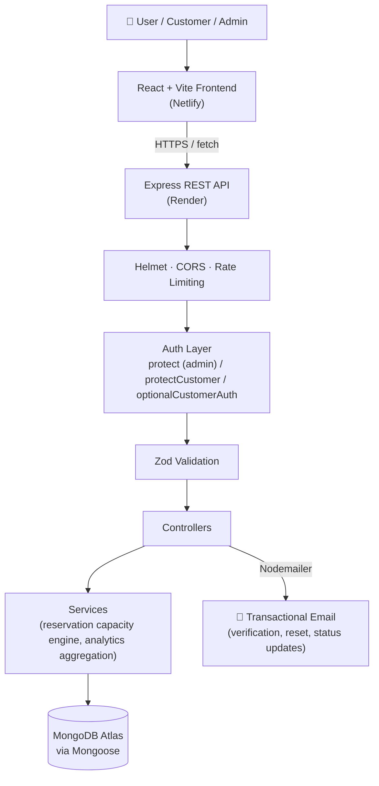
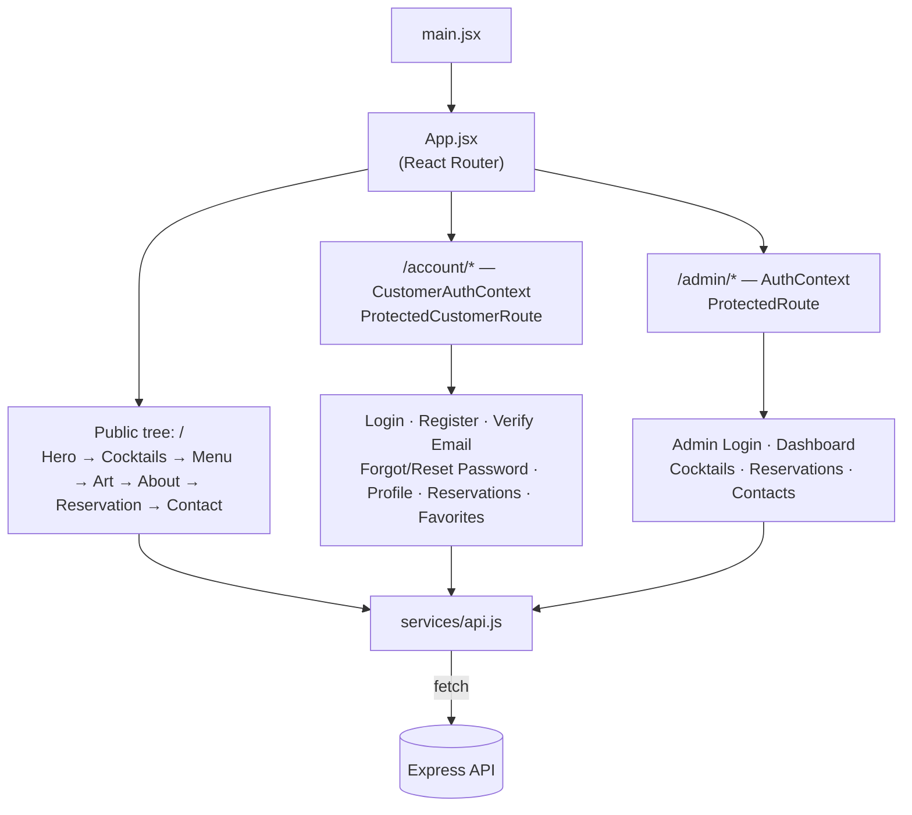
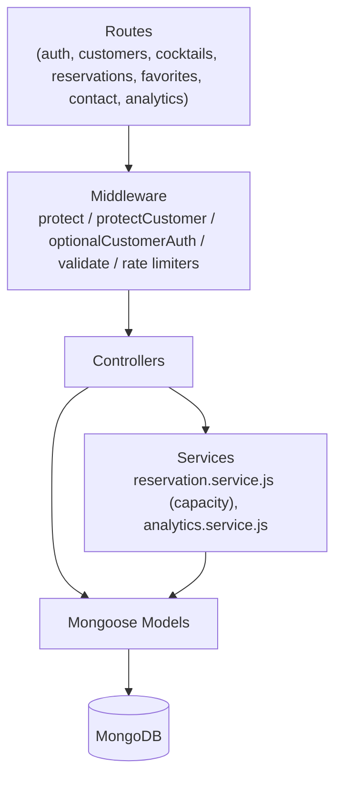

<div align="center">

# 🍸 Velvet Pour

**A full-stack, production-grade cocktail bar platform** — an animated public storefront, a dual-role authentication system for staff and guests (with email verification and password reset), a real reservation engine with actual capacity math, a like/favorites system, and an admin analytics dashboard built on live MongoDB aggregation pipelines.

[](https://react.dev)
[](https://vitejs.dev)
[](https://nodejs.org)
[](https://expressjs.com)
[](https://www.mongodb.com)
[](https://gsap.com)
[](https://tailwindcss.com)
[](https://jwt.io)
[](https://vitest.dev)
[](https://render.com)
[](https://netlify.com)

### 🌐 Live Demo

**[velvetpourretro.netlify.app](https://velvetpourretro.netlify.app/)** — the live site
&nbsp;·&nbsp;
**[velvet-pour-33go.onrender.com](https://velvet-pour-33go.onrender.com/)** — the API
&nbsp;·&nbsp;
**[/api/docs](https://velvet-pour-33go.onrender.com/api/docs)** — interactive Swagger docs

> The backend is on Render's free tier, so the first request after a while may take ~30–50s to cold-start. Everything after that is normal speed.

</div>

---

## Overview

Velvet Pour started as a GSAP animation showcase — the kind of Awwwards-style scroll experience you build to learn ScrollTrigger — and grew into something with a real backend behind it: a customer account system with email verification and password reset, a reservation engine that actually enforces per-slot capacity instead of just emailing someone, a favorites system backed by a real join collection, and an admin dashboard driven by live MongoDB aggregation pipelines rather than client-side arithmetic.

It's built for two audiences at once. A **guest** lands on an animated, cocktail-bar storefront, can browse the menu, like drinks, and book a table — with or without an account. A **customer** who registers gets a dashboard: profile, reservation history, and a favorites list that follows them across devices. Behind both of those, an **admin** manages the whole operation — confirming reservations, editing the menu, triaging contact messages, and reading real usage analytics.

This isn't a tutorial clone with the serial numbers filed off. Every non-obvious decision — the reservation's check-then-act capacity model, the deliberately-separate admin/customer auth boundary, the idempotent-by-database favorites system — is a decision that was made and is documented below, trade-offs included, rather than hidden behind "it just works."

**What's actually in it:**
- **Frontend** — React 19 + Vite, animated with GSAP (`ScrollTrigger`, `SplitText`, scroll-scrubbed video, pinned mask transitions), routed with React Router v7, data-fetched with TanStack Query v5, styled with Tailwind CSS v4.
- **Backend** — Node.js + Express 4 REST API, Mongoose 8 over MongoDB, every write path validated through Zod.
- **Auth & security** — Two independent JWT-based auth systems (admin vs. customer) sharing a signing secret but never a role, `bcryptjs` password hashing, email verification + password reset via Nodemailer, Helmet, CORS locked to a configured origin, and rate limiting on every form-submission and login endpoint.
- **Database** — Seven Mongoose models (`Admin`, `Customer`, `Cocktail`, `Reservation`, `SlotCapacity`, `Contact`, `Favorite`), with a genuinely relational `Favorite` join collection instead of an embedded array.
- **API** — A fully resourceful REST surface, documented live via Swagger UI at `/api/docs`.
- **Animation system** — Not just "GSAP is used." A scroll-scrubbed hero video, a pinned mask-reveal timeline in the Art section, staggered `SplitText` character/line reveals, and parallax leaf/arrow drift — all covered in detail in [Animations & GSAP](#-animations--gsap).

## 🎬 Frontend Showcase

`public/videos/Video Project.mkv` is a screen-recorded walkthrough of the live Home page — the hero's scroll-scrubbed video reveal, the `SplitText` title/subtitle stagger, the parallax leaf drift, the Art section's pinned mask transition, and the cocktail/menu sections as you scroll through them.

https://github.com/user-attachments/assets/039bd298-c129-43a0-9560-012602d31220

The player above is fully interactive — play, pause, and seek through it right on this page. (The source `.mkv` recording itself is still checked into `public/videos/home.mkv` for anyone who wants the original file rather than the encoded upload above.)

### Video asset structure

```
public/
└── videos/
    ├── input.mp4    # Source clip for the hero background
    ├── output.mp4    # Encoded/optimized clip actually used by Hero.jsx
    └── home.mkv       # Screen-recorded Home page walkthrough (showcase)
```

`output.mp4` is the file `Hero.jsx` actually renders — its `currentTime` is scrubbed frame-by-frame against scroll position via a pinned GSAP `ScrollTrigger` (see [Animations & GSAP](#-animations--gsap)). `input.mp4` isn't referenced anywhere in the source; going by the naming, it's the unprocessed source footage that `output.mp4` was encoded from, kept alongside it as the original asset.

## 👤 User / Customer Experience

The journey a visitor actually takes, page by page:

| Page | What happens there |
|---|---|
| **Home** (`/`) | The full animated storefront in one scroll: Hero (scroll-scrubbed video, `SplitText` title), Cocktails showcase, Menu, the Art section's pinned mask reveal, About, Reservation form, Contact form — all in a single-page scroll experience. |
| **Reservation** (in-page section) | Book a table without an account (guest booking) or, if logged in, with your name/email pre-filled and the booking automatically linked to your account. Enforced against real operating-hours and per-slot capacity rules — see [Reservation Rules](#-reservation-rules). |
| **Register / Login** (`/account/register`, `/account/login`) | Customer signup and login, fully independent of the admin login. |
| **Verify Email** (`/account/verify-email/:token`) | Confirms the account via the link sent on registration. |
| **Forgot / Reset Password** (`/account/forgot-password`, `/account/reset-password/:token`) | Requests and completes a password reset — responds identically whether or not the email exists, so the endpoint can't be used to enumerate registered accounts. |
| **My Velvet Pour → Profile** (`/account/profile`) | View/update your name, resend the verification email if you haven't confirmed yet. |
| **My Velvet Pour → Reservations** (`/account/reservations`) | Your reservation history — pending, confirmed, or cancelled — with the ability to cancel an upcoming one yourself. |
| **My Velvet Pour → Favorites** (`/account/favorites`) | Every cocktail you've liked, in one place. Liking/unliking works from the Home page menu too — it's optimistic in the UI and idempotent at the database level either way. |

Guest bookings work exactly the same as before an account existed — logging in later doesn't require re-booking, it just links future (and, going forward, existing) reservations to the customer record.

## 🛠️ Admin / User Management

### Customer side
- Registers and authenticates independently of admin (separate JWT role claim, separate token storage key, separate protective middleware — `protectCustomer` vs. `protect`).
- Can create/cancel their own reservations, like/unlike cocktails, and update their own profile — nothing more. A customer token is rejected outright by every admin-only route.
- Guest (unauthenticated) bookings are still fully supported; `optionalCustomerAuth` attaches a customer only if a valid token happens to be present, and never rejects the request otherwise.

### Admin side
- Separate login (`/admin/login`) issuing an admin-scoped JWT, checked by a completely different middleware (`auth.middleware.js`) than the customer one.
- **Reservations** (`/admin/reservations`) — view all bookings, confirm a pending reservation, cancel or edit one (with the same capacity re-validation the public booking flow uses), delete it outright.
- **Cocktails** (`/admin/cocktails`) — full CRUD over the menu: name, category, tier, country, price, image, description, availability toggle.
- **Contact messages** (`/admin/contacts`) — read and delete messages submitted through the public contact form.
- **Dashboard analytics** (`/admin/dashboard`) — reservation volume by date, busiest time slots, menu composition by category/tier, contact-message volume over time, and a most-liked-cocktails leaderboard — every one of these computed server-side via a MongoDB aggregation pipeline, not fetched raw and crunched in the browser.
- Full interactive API reference at **[`/api/docs`](https://velvet-pour-33go.onrender.com/api/docs)** (Swagger UI).

A reservation's lifecycle is deliberately **`pending → confirmed`**, not auto-confirmed: a new booking reserves its seats immediately (so capacity math is correct the instant it's created) but stays `pending` until an admin confirms it — same as a real restaurant taking a booking and calling to confirm it.

## 🖥️ Frontend

- **React 19 + Vite 8**, single-page app, no server-side rendering — a deliberate choice for a marketing/booking site over a data-heavy dashboard.
- **Routing** — React Router v7, with two parallel route trees: the public/customer tree (`/`, `/account/*`) and the admin tree (`/admin/*`), each behind its own route guard (`ProtectedCustomerRoute` / `ProtectedRoute`).
- **State & data** — TanStack Query v5 owns every server-derived piece of state (profile, reservations, favorites, admin lists, analytics) — no Redux, no manual cache invalidation; local component state (`useState`) is reserved for actual UI/form state.
- **API layer** — `src/services/api.js` is the single place every `fetch` call lives, so there's exactly one spot that knows the base URL, auth headers, and response-error shape.
- **Auth flow** — `AuthContext` (admin) and `CustomerAuthContext` (customer) are two independent React contexts, each storing its own token under its own `localStorage` key — mirroring the backend's separation rather than papering over it with one shared context and a role flag.
- **Forms** — controlled inputs throughout, with inline validation-error display driven by the API's own Zod error responses (no duplicate client-side validation schema to keep in sync).
- **Loading/error states** — every data-fetching page distinguishes loading / error / empty / loaded explicitly rather than rendering a spinner forever on failure.
- **Responsive design** — `react-responsive` media queries adapt animation trigger points (e.g., the Art section's pin `start` position, the Hero video's scrub range) for mobile, not just the CSS layout.

## 🎨 Animations & GSAP

This is the part of the project that started it all, so it's worth being specific rather than saying "GSAP is used for animations."

- **Hero (`Hero.jsx`)** — `SplitText` explodes the `MOJITO` title into characters and the subtitle into lines, each revealed with a staggered `yPercent`/opacity tween. Separately, a `<video>` element's `currentTime` is driven directly by scroll: a pinned `ScrollTrigger` timeline tweens `videoRef.current.currentTime` from `0` to the video's own duration as the section scrolls, so scrolling *is* scrubbing the video, frame-accurate, rather than just autoplaying it. The leaf images and the scroll-arrow drift in opposite directions on the same scroll range for a cheap parallax effect.
- **Art section (`Art.jsx`)** — a single pinned (`pin: true`), scrubbed (`scrub: 1.5`) `ScrollTrigger` timeline: the surrounding feature-list text fades out (`.will-fade`), then a CSS `mask-image` on the cocktail photo scales and repositions (`maskPosition`/`maskSize` tweened directly), before the following content section fades in. It's one continuous timeline tied to scroll progress, not three separate triggers — that's what makes the reveal feel like one motion instead of three unrelated animations. The pin's `start` point itself shifts (`top top` vs. `top 20%`) based on `react-responsive`'s mobile breakpoint.
- **Cocktails/Menu sections** — `ScrollTrigger`-driven reveals as each section enters the viewport, consistent with the rest of the page's stagger timing.
- **Reservation form** — a lighter `SplitText` word-reveal on the section heading via `useGSAP`, so the whole page shares one animation vocabulary rather than the form looking bolted on.

All of it runs through `@gsap/react`'s `useGSAP` hook, which handles cleanup automatically on unmount/dependency change — there's no manual `ScrollTrigger.kill()` bookkeeping scattered through the components.

## ⚙️ Backend

Request flow, end to end:

```
Client
  → Express (Helmet, CORS, JSON body limit)
    → Route (public / protect / protectCustomer / optionalCustomerAuth)
      → Zod validate() middleware
        → Controller
          → Service layer (reservation capacity math, analytics aggregation)
            → Mongoose model → MongoDB
          ← consistent { success, data } / { success, message } JSON
    → errorHandler (single, centralized — every thrown error lands here)
```

- **Express 4**, structured as `routes → middleware → controllers → services → models`, with `services/` reserved specifically for logic that doesn't belong in a controller (the reservation capacity engine, the analytics aggregation pipelines).
- **Validation** — every write endpoint (and every paginated/query endpoint) runs through a Zod schema via a shared `validate()` middleware, before the controller ever sees the request.
- **Authentication** — JWT-based, but split into two independently-checked systems: `auth.middleware.js` (admin) and `protectCustomer.middleware.js` (customer) each verify the token *and* its role claim before touching their respective collection — an admin token cannot authenticate a customer route, and vice versa, verified end-to-end in the test suite via real login flows for both roles.
- **`optionalCustomerAuth`** — used on routes that should work for guests but personalize for logged-in customers (booking a table, viewing a cocktail's like status). A missing, malformed, or expired token never rejects the request; it's simply ignored and the request proceeds as a guest.
- **Password security** — `bcryptjs` hashing, never a plaintext comparison.
- **Email verification & password reset** — Nodemailer-backed; registration sends a verification link, and `forgot-password` always returns the same generic `200` response whether or not the email is registered — the API response itself can't be used to enumerate accounts, only a genuinely-registered address ever receives an email.
- **Rate limiting** — `express-rate-limit` on login and on every public form-submission endpoint (contact, registration, reservation creation).
- **Security headers & CORS** — Helmet with a route-scoped, relaxed CSP specifically for `/api/docs` (Swagger UI needs inline scripts to render, so rather than loosening the whole app's CSP, only that one route gets a second, permissive `helmet()` call), CORS locked to `CLIENT_URL`.
- **Error handling** — a single centralized `errorHandler` middleware; every controller uses a shared `asyncHandler` wrapper so a thrown/rejected error from anywhere always reaches it, rather than each route catching its own.
- **Environment variables** — `PORT`, `MONGO_URI`, `CLIENT_URL`, `NODE_ENV`, `JWT_SECRET`, `JWT_EXPIRES_IN`, plus `SMTP_HOST`/`SMTP_PORT`/`SMTP_SECURE`/`SMTP_USER`/`SMTP_PASS`/`SMTP_FROM` for outgoing mail.
- **API response shape** — consistently `{ success: true, data }` or `{ success: true, message }` on success, `{ success: false, message }` on error, so the frontend's response handling is one function, not one per endpoint.

## 🗄️ Database

MongoDB via Mongoose, seven collections:

| Model | Purpose |
|---|---|
| `Admin` | Staff accounts — email + hashed password, no public registration route. |
| `Customer` | Guest accounts — hashed password, `isEmailVerified` flag, password-reset token hash + expiry. |
| `Cocktail` | The menu — name, category, tier, country, price, image, description, availability. |
| `Reservation` | A booking — name/email/phone (works for guests), date/time/guest count, `status` (`pending`/`confirmed`/`cancelled`/`waitlisted`), and an optional `customer` reference. |
| `SlotCapacity` | One document per unique `(date, time)` slot, tracking `bookedGuests` — this is what actually gets checked/incremented/decremented on every reservation create/update/cancel, so capacity math never has to re-aggregate every reservation on every request. |
| `Contact` | Messages submitted through the public contact form. |
| `Favorite` | The customer↔cocktail like relationship — a real join document (`{ customer, cocktail }`) with a **compound unique index**, not an array embedded on either side. |

**Why a join collection for favorites, not an embedded array:** a compound unique index on `(customer, cocktail)` means the database itself refuses a duplicate like — it's not application code's job to check first. `find({ customer })` and an aggregation `$group` by `cocktail` cover "this customer's favorites" and "this cocktail's like count" respectively, both cheaply, from the same collection.

**Why `SlotCapacity` is its own collection, not a derived count:** capacity checking happens on every booking attempt, so it's a single indexed document read/write instead of summing every reservation for a slot on every request.

Seed data lives in `backend/src/seed/` — `cocktails.js` populates the menu, `createAdmin.js` creates a single admin account from environment/CLI input.

## 📡 API Documentation

Full interactive reference (request/response schemas, try-it-out): **[`/api/docs`](https://velvet-pour-33go.onrender.com/api/docs)**, generated from `swagger-jsdoc` annotations already in the route files — it documents the real routes, not a hand-maintained copy that drifts.

### Authentication

| Method | Endpoint | Description | Auth |
|---|---|---|---|
| POST | `/api/auth/login` | Admin login | Public (rate-limited) |
| POST | `/api/customers/register` | Customer registration | Public (rate-limited) |
| POST | `/api/customers/login` | Customer login | Public (rate-limited) |
| GET | `/api/customers/verify-email/:token` | Verify a customer's email | Public |
| POST | `/api/customers/resend-verification` | Resend the verification email | Customer |
| POST | `/api/customers/forgot-password` | Request a password reset | Public (rate-limited) |
| POST | `/api/customers/reset-password/:token` | Complete a password reset | Public (rate-limited) |

### Customers

| Method | Endpoint | Description | Auth |
|---|---|---|---|
| GET | `/api/customers/me` | Get the logged-in customer's profile | Customer |
| PUT | `/api/customers/me` | Update the logged-in customer's profile | Customer |
| GET | `/api/customers/me/favorites` | Get the logged-in customer's liked cocktails | Customer |

### Cocktails

| Method | Endpoint | Description | Auth |
|---|---|---|---|
| GET | `/api/cocktails` | List the menu (paginated on request, full list otherwise) | Public |
| GET | `/api/cocktails/:id` | Get one cocktail | Public |
| POST | `/api/cocktails` | Create a cocktail | Admin |
| PUT | `/api/cocktails/:id` | Update a cocktail | Admin |
| DELETE | `/api/cocktails/:id` | Delete a cocktail | Admin |

### Reservations

| Method | Endpoint | Description | Auth |
|---|---|---|---|
| POST | `/api/reservations` | Create a reservation (guest or logged-in) | Public (rate-limited, optional customer link) |
| GET | `/api/reservations/mine` | The logged-in customer's own reservations | Customer |
| DELETE | `/api/reservations/mine/:id` | Cancel one of your own reservations | Customer |
| GET | `/api/reservations` | List all reservations (paginated) | Admin |
| GET | `/api/reservations/:id` | Get one reservation | Admin |
| PUT | `/api/reservations/:id` | Update/confirm/cancel a reservation | Admin |
| DELETE | `/api/reservations/:id` | Delete a reservation | Admin |

### Favorites

| Method | Endpoint | Description | Auth |
|---|---|---|---|
| POST | `/api/favorites/:cocktailId` | Like a cocktail (idempotent) | Customer |
| DELETE | `/api/favorites/:cocktailId` | Unlike a cocktail (idempotent) | Customer |

### Contact

| Method | Endpoint | Description | Auth |
|---|---|---|---|
| POST | `/api/contact` | Submit the public contact form | Public (rate-limited) |
| GET | `/api/contact` | List messages (paginated) | Admin |
| GET | `/api/contact/:id` | Get one message | Admin |
| DELETE | `/api/contact/:id` | Delete a message | Admin |

### Analytics (Admin only)

| Method | Endpoint | Description |
|---|---|---|
| GET | `/api/analytics/reservations-by-date` | Reservation volume over time |
| GET | `/api/analytics/busiest-slots` | Busiest time slots |
| GET | `/api/analytics/cocktail-breakdown` | Menu composition by category/tier |
| GET | `/api/analytics/contact-volume` | Contact-message volume over time |
| GET | `/api/analytics/most-liked-cocktails` | Most-liked cocktails leaderboard |

## 🏗️ System Architecture



## 🧩 Frontend Architecture



## 🔧 Backend Architecture



## 🧠 Engineering Highlights

**Role-based auth is a checked boundary, not a coincidence.** Admin and customer tokens share a signing secret but carry an explicit `role` claim, checked *before* either middleware queries its respective collection — verified end-to-end via real login flows for both roles in the test suite, not just hand-crafted tokens.

**Reservations reserve their seats the moment they're created.** A new booking is created `pending` (not `confirmed`) — but it holds its slot capacity immediately, so two guests can't both book the last table while waiting on admin approval. Confirming, cancelling, and rebooking all correctly account for which statuses currently hold capacity (`pending` and `confirmed` do, `cancelled` and `waitlisted` don't).

**The reservation engine has a documented, conscious trade-off.** Capacity checking is check-then-act, not atomic — under near-simultaneous bookings for a nearly-full slot, a narrow race window exists. Cancelled reservations are correctly excluded from capacity math, different time slots are independent, and rebooking excludes the reservation's own ID from its own capacity check.

**Password reset can't be used to enumerate accounts.** `/forgot-password` returns the identical `200` + generic message whether or not the email belongs to an account — only a real account ever actually receives an email.

**Favorites use a real join collection with a compound unique index**, not an array embedded on either side — the database itself prevents a duplicate like. Liking/unliking are both idempotent via atomic upsert/delete, so a double-tap on the heart button never errors.

**A public route staying public, under a real constraint.** `optionalCustomerAuth` attaches a customer to a reservation or a like status *if* a valid token is present, but a missing, malformed, or expired token never rejects the request.

**Swagger UI's inline scripts vs. a strict CSP, resolved without weakening either.** `/api/docs` gets a second, scoped `helmet()` call with a relaxed policy, verified to apply only to that route.

## 🏗️ Tech Stack

| Layer | Technology |
|---|---|
| **Frontend** | React 19 · Vite 8 |
| **Routing** | React Router v7 |
| **Data fetching** | TanStack Query v5 |
| **Styling** | Tailwind CSS v4 |
| **Animation** | GSAP 3 (`@gsap/react`, `SplitText`, `ScrollTrigger`) |
| **Charts** | Recharts |
| **Backend** | Node.js · Express 4 |
| **Database** | MongoDB · Mongoose 8 |
| **Authentication** | JWT (`jsonwebtoken`) with an explicit role claim · `bcryptjs` |
| **Validation** | Zod |
| **Email** | Nodemailer |
| **Security** | Helmet · `express-rate-limit` · CORS |
| **API Docs** | `swagger-jsdoc` + `swagger-ui-express`, live at `/api/docs` |
| **Testing** | Vitest · Supertest · `mongodb-memory-server` (real in-memory MongoDB, not mocks) |
| **Deployment** | Netlify (frontend) · Render (backend) · MongoDB Atlas (database) |

## 📁 Project Structure

```
velvet-pour/
├── backend/
│   ├── src/
│   │   ├── config/          # DB connection, reservation rules, Swagger spec
│   │   ├── controllers/     # Route handlers, one per resource
│   │   ├── middleware/      # protect, protectCustomer, optionalCustomerAuth, validate, rate limiters, error handler
│   │   ├── models/          # Admin, Customer, Cocktail, Reservation, SlotCapacity, Contact, Favorite
│   │   ├── routes/          # Express routers, documented inline via JSDoc/Swagger
│   │   ├── services/        # Reservation capacity engine, analytics aggregation
│   │   ├── validators/      # Zod schemas
│   │   ├── seed/            # Cocktail + admin seeding scripts
│   │   └── tests/           # Vitest + Supertest, against a real in-memory MongoDB
│   └── package.json
├── public/
│   └── videos/
│       ├── input.mp4        # Hero source clip
│       ├── output.mp4       # Encoded clip scrubbed by Hero.jsx
│       └── home.mkv         # Home page showcase recording
└── src/                     # Frontend (Vite root)
    ├── components/          # Hero, Cocktails, Menu, Art, About, Reservation, Contact, NavBar, ...
    ├── pages/
    │   ├── account/         # Login, Register, Verify Email, Forgot/Reset Password, Profile, Reservations, Favorites
    │   └── admin/           # Admin login, dashboard, cocktails, reservations, contacts
    ├── context/             # AuthContext (admin), CustomerAuthContext — deliberately separate
    ├── hooks/               # useAuthGuard, useCustomerAuthGuard, useCocktailLikes
    └── services/api.js      # All backend calls in one place
```

## 🚀 Local Development Setup

### Prerequisites
- Node.js 18+
- npm
- A MongoDB connection string (local or [MongoDB Atlas](https://www.mongodb.com/atlas))
- Git

### 1. Clone and install

```bash
git clone <your-repo-url>
cd velvet-pour

# Frontend
npm install

# Backend
cd backend
npm install
```

### 2. Configure environment variables

Copy `backend/.env.example` to `backend/.env` and fill in your own values:

```env
PORT=5000
MONGO_URI=your_mongodb_connection_string
CLIENT_URL=http://localhost:5173
NODE_ENV=development
JWT_SECRET=your_long_random_secret
JWT_EXPIRES_IN=7d

SMTP_HOST=your_smtp_host
SMTP_PORT=587
SMTP_SECURE=false
SMTP_USER=your_smtp_username
SMTP_PASS=your_smtp_password
SMTP_FROM="Velvet Pour <no-reply@example.com>"
```

> **Never commit `.env`.** It's already gitignored — keep it that way.

### 3. Seed the database

```bash
cd backend
npm run seed                    # populates the cocktail menu
node src/seed/createAdmin.js    # creates an admin account
```

### 4. Run it

```bash
# Terminal 1 — backend
cd backend
npm run dev              # http://localhost:5000

# Terminal 2 — frontend
npm run dev               # http://localhost:5173
```

Visit `http://localhost:5173` for the site, `http://localhost:5000/api/docs` for the interactive API documentation, and `http://localhost:5173/admin/login` for the admin dashboard.

## 🧪 Testing

```bash
cd backend
npm test
```

Runs against a real, ephemeral in-memory MongoDB (`mongodb-memory-server`) — not mocks.

| Suite | What it checks |
|---|---|
| `smoke.test.js` | Basic app health, 404 handling |
| `pagination.test.js` | Opt-in vs. mandatory pagination behavior |
| `reservation-engine.test.js` | Time-slot validation, capacity math across multiple bookings, cancelled-exclusion, different-slot independence, rebooking self-exclusion, customer linking |
| `cocktails.test.js` | Menu CRUD, Zod validation on writes |
| `contact.test.js` | Contact form validation, error-handler regression checks |
| `customer-auth.test.js` | Registration, login, profile, role separation (verified through real login flows for both roles) |
| `password-reset.test.js` | Email verification, resend verification, forgot/reset password — including the no-enumeration guarantee |
| `favorites.test.js` | Idempotent like/unlike (checked at the database level), `isLikedByMe` visibility, most-liked ranking |

## 📖 Reservation Rules

Configured in `backend/src/config/reservationRules.js`, not hardcoded into logic:

| Rule | Value |
|---|---|
| Opening time | 17:00 |
| Closing time | 23:00 |
| Slot interval | 30 minutes |
| Max guests per slot | 40 |
| Max party size (per booking) | 12 |

A slot's 40-guest capacity is filled by however many individual bookings it takes — no single reservation is allowed to exceed the 12-guest party cap, even if it would otherwise fit the remaining capacity.

## 🌐 Deployment

| Component | Platform | URL |
|---|---|---|
| Frontend (Vite build) | [Netlify](https://netlify.com) | [velvetpourretro.netlify.app](https://velvetpourretro.netlify.app/) |
| Backend (Express API) | [Render](https://render.com) | [velvet-pour-33go.onrender.com](https://velvet-pour-33go.onrender.com/) |
| Database | [MongoDB Atlas](https://www.mongodb.com/atlas) | Private — no public URL (see note below) |

`VITE_API_URL` on Netlify points at the Render backend's `/api` path, and `CLIENT_URL` on Render is set to the Netlify URL — the CORS configuration depends on this matching exactly in both directions.

> **On the empty Database URL:** unlike the frontend/backend, MongoDB Atlas has no public "live site" link to share — the cluster is only reachable via its connection string (`MONGO_URI`), which is a secret and must never be committed or pasted into a README. The link above just points to Atlas itself, not to this project's specific cluster.

## 🗺️ Known Limitations & Roadmap

Documented honestly rather than hidden:

- **Reservation capacity checking has a narrow race-condition window** under near-simultaneous bookings for a nearly-full slot (check-then-act, not atomic). A conscious trade-off for this project's scale — noted in code, not silently "fixed" with heavier machinery it doesn't need.
- **No customer-facing ordering system.** "My Orders" was deliberately scoped out — there's no menu-ordering/checkout flow anywhere in the app, so an `Order` model with nothing real to populate it would be unconnected CRUD.
- **Docker & CI/CD are deferred**, not yet implemented — deliberately, pending further learning rather than half-attempted.

## 📄 License

MIT — or update this section to match your course's requirements.

---

<div align="center">

### Built by Lakshay Aggarwal

[](https://www.linkedin.com/in/lakshay-aggarwal-44443b336/)

<sub>Built with React, Express, MongoDB, GSAP, and an unreasonable amount of care about error handling.</sub>

</div>